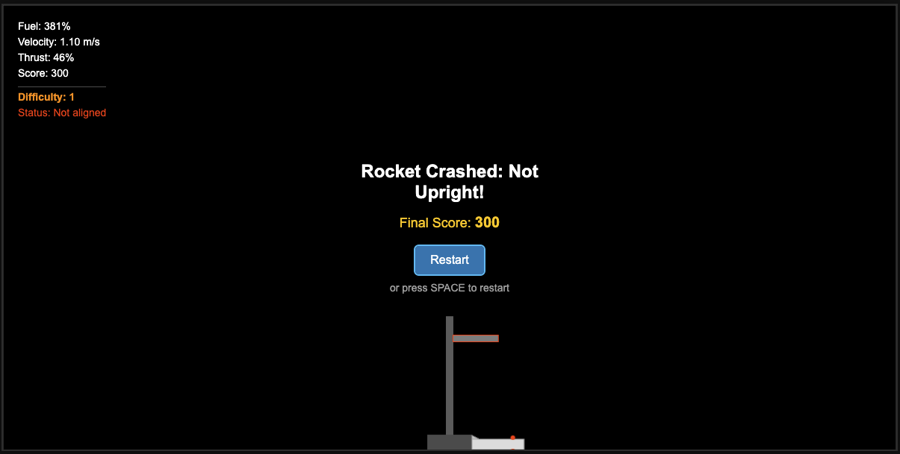
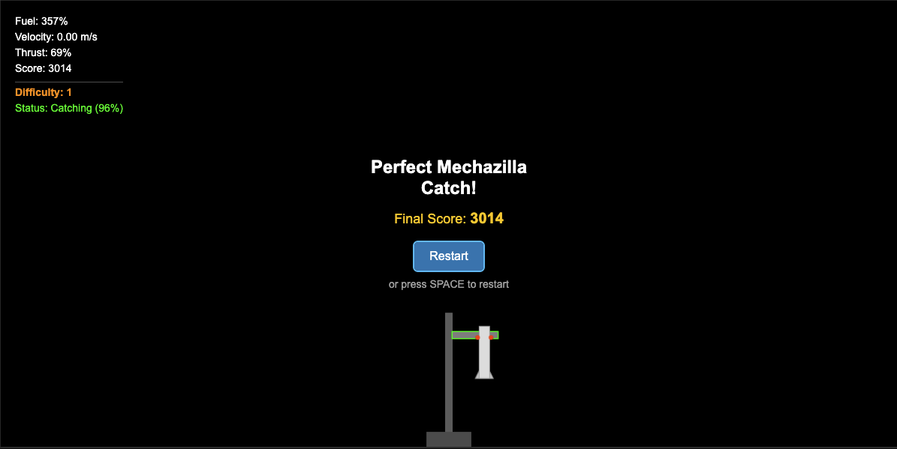

# Falcon Landing Game

A physics-based game inspired by SpaceX Falcon rocket landings on the Mechazilla tower.

It was made entirely by using Cursor ai.

## How to Play

1. Open `index.html` in your browser to start the game.
2. Control the Falcon rocket using the arrow keys:
   - **Up Arrow**: Fire thrusters to counteract gravity
   - **Left/Right Arrows**: Rotate the rocket
3. Your goal is to land the rocket on the Mechazilla catch system:
   - **Perfect Mechazilla Catch (2000 points)**: Align the rocket's catch points with the horizontal catch arms
   - **Tower Landing (1000 points)**: Land on the central Mechazilla tower (fallback option)

## Landing Mechanics

This game simulates SpaceX's Mechazilla catch system. The rocket has two red catch points near its top that need to align with the horizontal catch arms when landing. Timing and positioning are critical!

For a successful catch:
- Keep the rocket upright (minimal tilt)
- Maintain low landing velocity (under 2.5 m/s)
- Position the rocket so its catch points align with the catch arms
- Carefully control your approach for precise alignment

If you miss the catch arms or are not properly aligned, the rocket will crash and you'll fail the mission. Remember, SpaceX designed Mechazilla to catch rockets - not for them to land on a pad!

## Dynamic Difficulty System

The game features a progressive difficulty system:
- Each round starts with highly random initial conditions (position, velocity, and angle)
- Successfully landing the rocket increases your skill level
- Every 2 successful landings, the difficulty increases (up to level 5)
- Higher difficulties introduce more extreme starting conditions:
  - Much greater initial velocities, including occasional velocity "bursts"
  - Sometimes the rocket starts with upward momentum
  - More tilted starting positions
  - Higher starting points
  - More angular momentum

This ensures that every launch presents a unique challenge, requiring you to quickly adapt your approach!

## Scoring

- Perfect Mechazilla catch: 2000 points
- Tower landing: 1000 points (fallback option)
- Soft landing (velocity < 1.2): 300 bonus points
- Medium landing (velocity < 1.8): 150 bonus points
- Remaining fuel: 2 points per fuel percentage

## Game Requirements

The game uses the Matter.js physics library, which is loaded via CDN. No installation is required, but you need an internet connection to load the library.

## Current Version

This is a basic version with simplified graphics. Future versions will include more realistic textures and additional game features.

## Controls

- **Up Arrow**: Main thruster
- **Left Arrow**: Rotate counter-clockwise
- **Right Arrow**: Rotate clockwise
- **Space**: Restart game after landing/crash

Good luck with your catch! # falcon_play

## Screenshots

